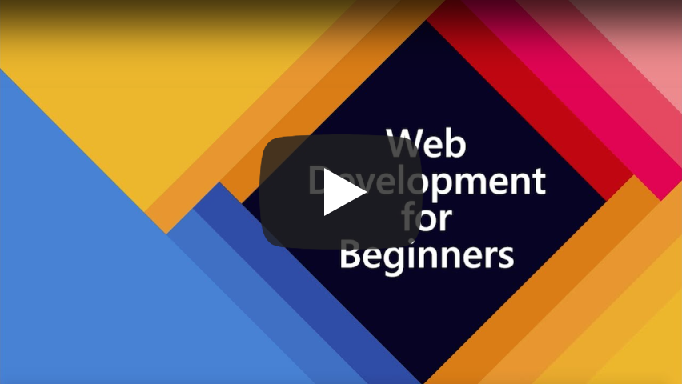

<!-- omit in toc -->
# Web Development for Beginners

<!-- omit in toc -->
## Table of Contents
- [Extenza Academy `WebDev-100` Course](#extenza-academy-webdev-100-course)
- [Original Promo Video](#original-promo-video)
- [Curriculum](#curriculum)
- [Pedagogy](#pedagogy)
- [Lessons structure](#lessons-structure)
- [Syllabus](#syllabus)
- [Current Version of the Course](#current-version-of-the-course)
  - [Extenza Academy `WebDev-100` course](#extenza-academy-webdev-100-course-1)
- [Success criteria](#success-criteria)
- [Trainer](#trainer)
  - [Vlad DX](#vlad-dx)
- [Timeline](#timeline)
- [Course requirements](#course-requirements)
- [Course Prerequisites](#course-prerequisites)
  - [Register](#register)
  - [Join](#join)
- [How to Start?](#how-to-start)
- [Course Capacity](#course-capacity)
- [Code of Conduct](#code-of-conduct)

## Extenza Academy `WebDev-100` Course

Level: `⭐ ▪ ▪ ▪` (100 out of 400)

> The course is based on the [microsoft / Web-Dev-For-Beginners](https://github.com/microsoft/Web-Dev-For-Beginners/tree/5dbe7e8bd9576eb7cdc8bca359449ccd559635a8) course.
> 
> Original course has 24 lessons and 12 weeks curriculum.
> 
> All original materials are licensed with MIT License.
> 
> Additional materials: © 2020 Vlad DX. All rights reserved.

## Original Promo Video

> Click the image above for a video about the project and the folks who created it!

## Curriculum

Azure Cloud Advocates at Microsoft created a 12-week, 24-lesson curriculum all about JavaScript, CSS, and HTML basics. Each lesson includes pre- and post-lesson quizzes, written instructions to complete the lesson, a solution, an assignment and more. Our project-based pedagogy allows you to learn while building, a proven way for new skills to 'stick'.

> **Students**, Try to create the projects by comprehending the lessons rather than copying the solution code; however that code is available in the /solutions folders in each project-oriented lesson. Another idea would be to form a study group with friends and go through the content together. For further study, we recommend [Microsoft Learn](https://docs.microsoft.com/users/jenlooper-2911/collections/jg2gax8pzd6o81?WT.mc_id=academic-4621-cxa) and by watching the videos mentioned below.

## Pedagogy

Authors of the materials have chosen two pedagogical tenets while building the curriculum: ensuring that it is project-based and that it includes frequent quizzes. By the end of this series, students will have built a typing game, a virtual terrarium, a 'green' browser extension, a 'space invaders' type game, and a business-type banking app, and will have learned the basics of JavaScript, HTML, and CSS along with the modern toolchain of today's web developer. 

By ensuring that the content aligns with projects, the process is made more engaging for students and retention of concepts will be augmented. There are also several starter lessons in JavaScript basics to introduce concepts, paired with video from the "[Beginners Series to: JavaScript](https://channel9.msdn.com/Series/Beginners-Series-to-JavaScript?WT.mc_id=cxaall-4621-cxall)" collection of video tutorials, some of whose authors contributed to this curriculum.

In addition, a low-stakes quiz before a class sets the intention of the student towards learning a topic, while a second quiz after class ensures further retention. This curriculum was designed to be flexible and fun and can be taken in whole or in part. The projects start small and become increasingly complex by the end of the 12 week cycle.

While we have purposefully avoided introducing JavaScript frameworks so as to concentrate on the basic skills needed as a web developer before adopting a framework, a good next step to completing this curriculum would be learning about Node.js via another collection of videos: "[Beginner Series to: Node.js](https://channel9.msdn.com/Series/Beginners-Series-to-Nodejs?WT.mc_id=cxaall-4621-cxall)".

> Find our [Code of Conduct](CODE_OF_CONDUCT.md)

## Lessons structure

**Each lesson includes**:

- optional sketchnote,
- optional supplemental video,
- pre-lesson warmup quiz,
- written lesson,
- for project-based lessons, step-by-step guides on how to build the project,
- knowledge checks,
- a challenge,
- supplemental reading,
- assignment,
- post-lesson quiz.

## Syllabus

|       |                           Project Name                            |                            Concepts Taught                             | Learning Objectives                                                                                                                 |                                                              Linked Lesson                                                              | Sketchnote | Video |         Author          |
| :---: | :---------------------------------------------------------------: | :--------------------------------------------------------------------: | ----------------------------------------------------------------------------------------------------------------------------------- | :-------------------------------------------------------------------------------------------------------------------------------------: | :--------: | :---: | :---------------------: |
|  01   |                          Getting Started                          |           Introduction to Programming and Tools of the Trade           | Learn the basic underpinnings behind most programming languages and about software that helps professional developers do their jobs | [Intro to Programming Languages and Tools of the Trade](./lessons/1-getting-started-lessons/1-intro-to-programming-languages/README.md) |     ✅      |   ✅   |         Jasmine         |
|  02   |                          Getting Started                          |             Basics of GitHub, includes working with a team             | How to use GitHub in your project, how to collaborate with others on a code base                                                    |                            [Intro to GitHub](./lessons/1-getting-started-lessons/2-github-basics/README.md)                             |     ✅      |   🛑   |          Floor          |
|  03   |                          Getting Started                          |                             Accessibility                              | Learn the basics of web accessibility                                                                                               |                       [Accessibility Fundamentals](./lessons/1-getting-started-lessons/3-accessibility/README.md)                       |     ✅      |   🛑   |       Christopher       |
|  04   |                             JS Basics                             |                         JavaScript Data Types                          | The basics of JavaScript data types                                                                                                 |                                       [Data Types](./lessons/2-js-basics/1-data-types/README.md)                                        |     ✅      |   ✅   |         Jasmine         |
|  05   |                             JS Basics                             |                         Functions and Methods                          | Learn about functions and methods to manage an application's logic flow                                                             |                              [Functions and Methods](./lessons/2-js-basics/2-functions-methods/README.md)                               |     ✅      |   ✅   | Jasmine and Christopher |
|  06   |                             JS Basics                             |                        Making Decisions with JS                        | Learn how to create conditions in your code using decision-making methods                                                           |                                 [Making Decisions](./lessons/2-js-basics/3-making-decisions/README.md)                                  |     ✅      |   ✅   |         Jasmine         |
|  07   |                             JS Basics                             |                            Arrays and Loops                            | Work with data using arrays and loops in JavaScript                                                                                 |                                   [Arrays and Loops](./lessons/2-js-basics/4-arrays-loops/README.md)                                    |     ✅      |   ✅   |         Jasmine         |
|  08   |       [Terrarium](./lessons/3-terrarium/solution/README.md)       |                            HTML in Practice                            | Build the HTML to create an online terrarium, focusing on building a layout                                                         |                                 [Introduction to HTML](./lessons/3-terrarium/1-intro-to-html/README.md)                                 |     ✅      |   🛑   |           Jen           |
|  09   |       [Terrarium](./lessons/3-terrarium/solution/README.md)       |                            CSS in Practice                             | Build the CSS to style the online terrarium, focusing on the basics of CSS including making the page responsive                     |                                  [Introduction to CSS](./lessons/3-terrarium/2-intro-to-css/README.md)                                  |     ✅      |   🛑   |           Jen           |
|  10   |            [Terrarium](./lessons/3-terrarium/solution)            |                 JavaScript Closures, DOM manipulation                  | Build the JavaScript to make the terrarium function as a drag/drop interface, focusing on closures and DOM manipulation             |                  [JavaScript Closures, DOM manipulation](./lessons/3-terrarium/3-intro-to-DOM-and-closures/README.md)                   |     ✅      |   🛑   |           Jen           |
|  11   |          [Typing Game](./lessons/4-typing-game/solution)          |                          Build a Typing Game                           | Learn how to use keyboard events to drive the logic of your JavaScript app                                                          |                                [Event-Driven Programming](./lessons/4-typing-game/typing-game/README.md)                                |     🛑      |   ✅   |       Christopher       |
|  12   | [Green Browser Extension](./lessons/5-browser-extension/solution) |                         Working with Browsers                          | Learn how browsers work, their history, and how to scaffold the first elements of a browser extension                               |                               [About Browsers](./lessons/5-browser-extension/1-about-browsers/README.md)                                |     ✅      |   🛑   |           Jen           |
|  13   | [Green Browser Extension](./lessons/5-browser-extension/solution) | Building a form, calling an API and storing variables in local storage | Build the JavaScript elements of your browser extension to call an API using variables stored in local storage                      |                [APIs, Forms, and Local Storage](./lessons/5-browser-extension/2-forms-browsers-local-storage/README.md)                 |     🛑      |   ✅   |           Jen           |
|  14   | [Green Browser Extension](./lessons/5-browser-extension/solution) |          Background processes in the browser, web performance          | Use the browser's background processes to manage the extension's icon; learn about web performance and some optimizations to make   |             [Background Tasks and Performance](./lessons/5-browser-extension/3-background-tasks-and-performance/README.md)              |     🛑      |   🛑   |           Jen           |
|  15   |           [Space Game](./lessons/6-space-game/solution)           |             More Advanced Game Development with JavaScript             | Learn about Inheritance using both Classes and Composition and the Pub/Sub pattern, in preparation for building a game              |                      [Introduction to Advanced Game Development](./lessons/6-space-game/1-introduction/README.md)                       |     🛑      |   🛑   |          Chris          |
|  16   |           [Space Game](./lessons/6-space-game/solution)           |                           Drawing to canvas                            | Learn about the Canvas API, used to draw elements to a screen                                                                       |                                [Drawing to Canvas](./lessons/6-space-game/2-drawing-to-canvas/README.md)                                |     🛑      |   🛑   |          Chris          |
|  17   |           [Space Game](./lessons/6-space-game/solution)           |                   Moving elements around the screen                    | Discover how elements can gain motion using the cartesian coordinates and the Canvas API                                            |                           [Moving Elements Around](./lessons/6-space-game/3-moving-elements-around/README.md)                           |     🛑      |   🛑   |          Chris          |
|  18   |           [Space Game](./lessons/6-space-game/solution)           |                          Collision detection                           | Make elements collide and react to each other using keypresses and provide a cooldown function to ensure performance of the game    |                              [Collision Detection](./lessons/6-space-game/4-collision-detection/README.md)                              |     🛑      |   🛑   |          Chris          |
|  19   |           [Space Game](./lessons/6-space-game/solution)           |                             Keeping score                              | Perform math calculations based on the game's status and performance                                                                |                                    [Keeping Score](./lessons/6-space-game/5-keeping-score/README.md)                                    |     🛑      |   🛑   |          Chris          |
|  20   |           [Space Game](./lessons/6-space-game/solution)           |                     Ending and restarting the game                     | Learn about ending and restarting the game, including cleaning up assets and resetting variable values                              |                                [The Ending Condition](./lessons/6-space-game/6-end-condition/README.md)                                 |     🛑      |   🛑   |          Chris          |
|  21   |         [Banking App](./lessons/7-bank-project/solution)          |                 HTML Templates and Routes in a Web App                 | Learn how to create the scaffold of a multipage website's architecture using routing and HTML templates                             |                            [HTML Templates and Routes](./lessons/7-bank-project/1-template-route/README.md)                             |     🛑      |   ✅   |          Yohan          |
|  22   |         [Banking App](./lessons/7-bank-project/solution)          |                  Build a Login and Registration Form                   | Learn about building forms and handing validation routines                                                                          |                                           [Forms](./lessons/7-bank-project/2-forms/README.md)                                           |     🛑      |   ✅   |          Yohan          |
|  23   |         [Banking App](./lessons/7-bank-project/solution)          |                   Methods of Fetching and Using Data                   | How data flows in and out of your app, how to fetch it, store it, and dispose of it                                                 |                                            [Data](./lessons/7-bank-project/3-data/README.md)                                            |     🛑      |   ✅   |          Yohan          |
|  24   |         [Banking App](./lessons/7-bank-project/solution)          |                      Concepts of State Management                      | Learn how your app retains state and how to manage it programmatically                                                              |                                [State Management](./lessons/7-bank-project/4-state-management/README.md)                                |     🛑      |       |          Yohan          |

## Current Version of the Course

Extenza Academy Web Development for Beginners course "WebDev-100" is mainly based on the materials from original course. However, there are some differences.

### Extenza Academy `WebDev-100` course

- An **instructor-led** course being conducted by **Microsoft Certified Trainer**.
- Based on a GitHub Classroom / Google Classroom,
- Relies on **practicing a Scrum methodology**:
  - 1-week sprints,
  - Backlogs,
  - Refinement meetings,
  - Planning meetings,s,
  - Retrotra activities (Q&A sessions, webinars, challenges),
- Mock interview,
- Course certificate.

## Success criteria

Expectations for student that successfully finished the course:

- ☑ Acquired a hands-on experience with HTML, CSS, JavaScript,
- ☑ The Scurm methodology is practiced throughout the course,
- ☑ Practical Git skills are obtained,
- ☑ 5 educational projects are developed.

## Trainer

### Vlad DX

[LinkedIn Profile](https://www.linkedin.com/in/vladimirserykh)

- ⚡ Experienced Software Engineer, Microsoft Certified Trainer, Microsoft Certified Professional.
- 🚩 Main focus: Software Architecture, APIs, integrations, user lifecycle, and problem-solving.
- ☑ Prefer to work in self-organizing Scrum teams with DevOps practices.

 

Has 12+ years in software development and 18+ years of working experience in IT.

Fun fact: dealing with computers for about 28 years.

## Timeline

Course iterations:

- **Q1 2021** [Current]
  
  Dec 20, 2020 - Mar 13, 2021

- TBA (to be announced) 

## Course requirements

To take this course you need to have basic computer literacy and B1 level of English.

## Course Prerequisites

### Register

Please register accounts in the following services:

- [GitHub](https://github.com)
- [Discord](https://discord.com)
- [Google](https://accounts.google.com)

### Join

Join all 3 Discord channels for communication:

- Community channel
  
  [Extenza Academy / extenza-academy](https://discord.gg/enXAqzsekQ)

- For discussions related to the course

  [Extenza Academy / webdev-100-learn](https://discord.gg/bmTtfFkwup)

- Student chat
  
  [Extenza Academy / webdev-100-chat](https://discord.gg/78Bpeaq3Vq)

## How to Start?

1. Join the Google Classroom:
   
   https://classroom.google.com/c/MTg2MzYwNTk5OTUy?cjc=fdmpxpi

2. Contact the Trainer on Discord channel [Extenza Academy / webdev-100-learn](https://discord.gg/bmTtfFkwup) by mentioning him:
   
   > Hi `@vlad.dev.experience`, I'd like to join a course.

## Course Capacity

1 group of 4 people.

- Extenza Academy Web-100 2021-Q1
   - [x] Taken (M****)
   - [x] Taken (I****)
   - [x] Reserved (R****)
   - [ ] Available

## Code of Conduct

All participants must follow the [Code of Conduct](./CODE_OF_CONDUCT.md).
